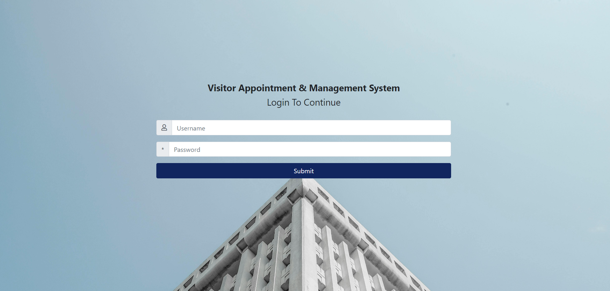
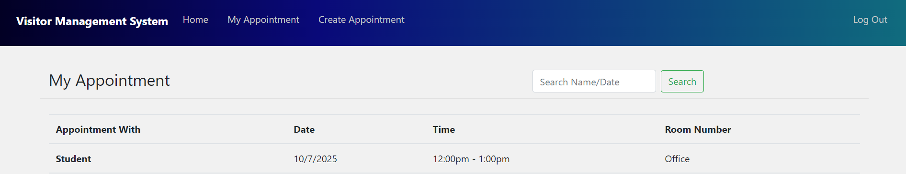
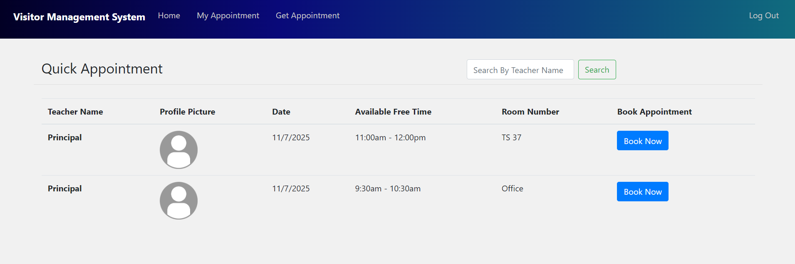
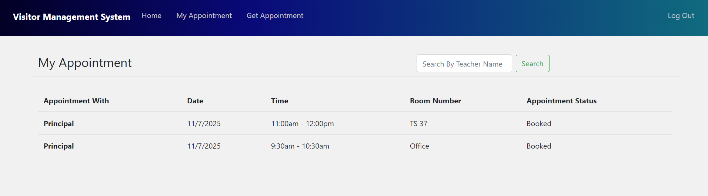

# 🛡️ Visitor Management System

A Django-based web application designed to optimize appointment scheduling and streamline communication within educational settings.

The Visitor Management System allows institutions to manage visitor appointments efficiently, reduce waiting times, and improve overall visitor experience through a secure, digital check-in and communication process.

---

## 🚀 Features

- 📝 Visitor Registration (name and other fields)
- ⏰ Scheduled time system
- 🔒 Secure login for admin
- 📜 Visitor logs/history
- 📊 Dashboard for viewing entries

---

## 🛠️ Tech Stack

- Backend: Python, Django
- Frontend: Django Templates, HTML, CSS, Bootstrap
- Database: SQLite

---

## 📦 Installation

Follow these steps to run the project locally:

1. **Clone the repository**:
   ```bash
   git clone https://github.com/yourusername/visitor-management-system.git
   cd visitor_management_system

2. **Create a virtual environment**:
   ```bash
   python -m venv venv

3. **Activate the virtual environment**:
   ```bash
   Windows: venv\Scripts\activate
   macOS/Linux: source venv/bin/activate

4. **Install dependencies**:
   ```bash
   pip install -r requirements.txt

5. **Apply migrations**:
   ```bash
   python manage.py migrate

6. **Run the development server**:
   ```bash
   python manage.py runserver

7. **Open the browser at**:
   ```bash
   http://127.0.0.1:8000/

---

## 📸 Screenshots

Here are a few screenshots to give you a visual overview of the application:

### Login Page


### Create Appointment - user


### Teacher Dashboard


### Available Appointments - User


### Student Dashboard (Appointment Details)


---

## 👩‍💻 Author

Developed by **Anna Seby**

---

## 📃 License
This project is licensed under the MIT License.

You are free to use, and distribute this software for any purpose, provided that the original copyright. 

© Anna Seby
 

